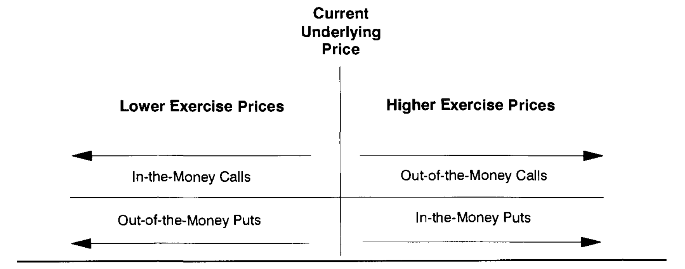
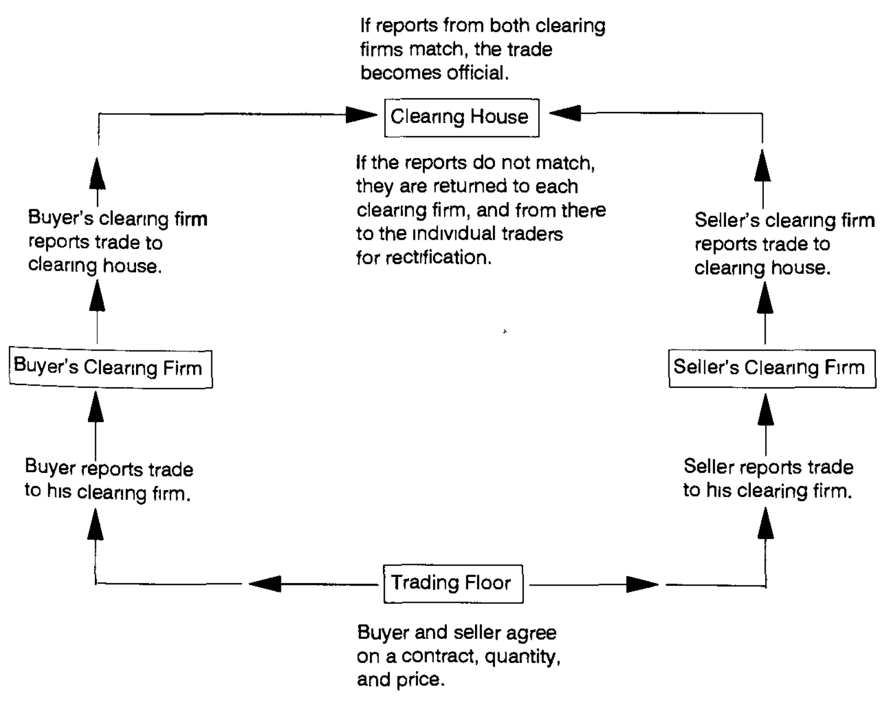

# Chapter 1: The Language of Options
> Without a healthy respect for the risks of option trading and a full understanding of risk management techniques, today's profits can quickly turn into tomorrow's losses

### Definitions and rules
* Call option: the right to buy or take a long position in a given asset at a fixed price on/before a specified date
* Put option: the right to sell or take a short position in a given asset on/before a specific date
* All rights lie with the buyer (of the option) and all obligations lie with the seller
* Underlying (asset): the asset involved
* Exercise/strike price: price to sell at, predetermined
* Buying at the bank - everything is tailored to buyer; buying at exchange - everything is determined by the exchange
* American: can be exercised any time pre-expiration; European: exercised only on expiration day
* Positive intrinsic value: *in the money* by x (i-val) amount; no i-val: *out of money*

### Exercise and assignment
* Long and short mean the same thing as it usually does
    * Buying a call option is a long position in the option.
    * Buying a put option is a long position in the option.
    * Selling (writing) a call option is a short position in the option.
    * Selling (writing) a put option is a short position in the option.
* Exercising
    * Exercising a call option results in a long position in the underlying asset.
    * Exercising a put option results in a short position in the underlying asset.

Process:
1. Buyer of option submits exercise notice to clearing firm
2. Clearing firm notifies clearing house
3. Clearing house chooses a seller/buyer at random, notifies their clearing firm that they've been assigned
4. Seller/buyer notified that they have a call/put option in \<instrument\> at \<x\> price

Basically people write options so they get premiums for taking on the risk. People can buy these options, and exercise them if necessary. It's betting that they don't (or do, depending on the option, but I currently can't imagine why you'd want someone to call)

A call will only have intrinsic value if the price is greater than the strike price. The intrinsic value is the difference between the two.
* An option is usually priced higher than its intrinsic value
* Additional premium is called **time premium** or **extrinsic value**
    * Willingly paid for safety and protection given by the option than just rawdogging long/short positions
    * If it's trading at 0 time premium, then it's trading at **parity**
* If the exercise price == current price the asset, it's at the money
    * Commonly used to describe puts/calls whose exercise prices is closest to the current prices of the underlying contract

> If a $400 gold call is trading at $50 with gold at $435, the time premium is $15 since the intrinsic value is $35.

### Market integrity
* Please don't default
* Clearing houses and firms try minimize that

### Margin requirements
* Good faith capital
* Requirements
* Sometimes yoinked by the firm, saying it's for fees or whatnot
* Insiders get reduced margin requirements

### Settlement procedures
Stock-type settlements and futures-type settlements

> Suppose I get 100 shares of $50 stock. I buy it, but it goes up before I get it, and it goes up to $60 a share. Who gets the $1000?

Stock type is when the buyer becomes the beneficial owner of the stock immediately after execution of the trade, not the settlement (typically T+2 days)

Futures type is when profits and losses are calculated and settled daily based on the closing prices of the futures contract.
* If it gains, then the buyer (me) gets the difference deposited in my account; if it loses, I pay the difference to the seller
* If I don't have enough cash on hand, the clearing house will issue a *variational call* 

Distinction between margin and variation call:
* Margin call: issued by clearing house, ensure trader can fulfill future financial obligations if market moves against him
    * Ensures he can pay by making him deposit money, he can still earn interest on it 
* Variation call: issed in order to fulfill current financial obligations - realized losses
    * Cash payment immediately deducted from the account
    * If the trader has deposited securities and he doesn't have enough cash, the house can sell those securities to make up to the total
    * If that isn't enough, he might have to liquidate his position

Important to know these since they dictate cash flow and what you're allowed to do; might get fucked over because you don't know the rules.
