# Chapter 2: Elementary Strategies
> Your mental models need training. At least 200 epochs. If you don't gradient descent, your accuracy will be low and your loss high.
Option traders have an unbelievably large number of choices available to him. This chapter details a few methods to cut throuhg the noise.
> The reader who is new to options may find it useful to sit down with the business section of a newspaper and graph a variety of options and underlying positions. This will enable him to become comfortable with many of the concepts introduced in the first two chapters, and will make the subsequent material that much more easier to understand.

Steps
1. Eliminate a bunch of options
2. Do it over and over again to train pattern recognition
3. Start seeing patterns, develop logic, start building strategies
4. Individual options -> combinations -> complex strategies involving multiple contracts

Valuation: either zero, at/out of money, or intrinsic value

## Buy and sell strategies
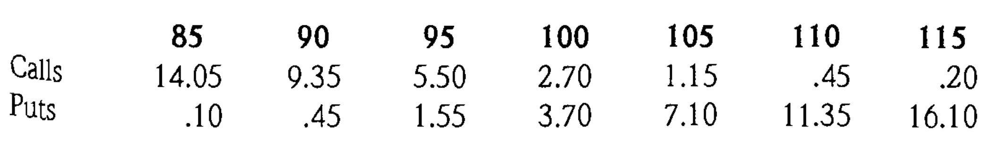

Calls
* The intrinsic value has to be greater than the strike price for it to be profitable
* Say you think the contract will rise to 110 before expiration. Then you can buy a 100 call for 2.70. The profit = intrinsic - 2.70 (7.30)
* On the same line, if you believe it's going to 110, you can sell 115 calls for .20 and assume it'll never be called, and pocket the difference.

Puts
* The intrinsic value must be greater than the market price for it to be profitable
* If it rises to 110 by expiration, any put less than 105 is worthless

> An option's value is always determinate on it's underlying asset

We can graph it, but first, profit and loss graph:
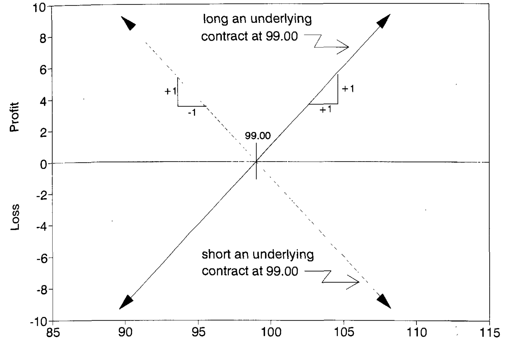

Put and call graph: 
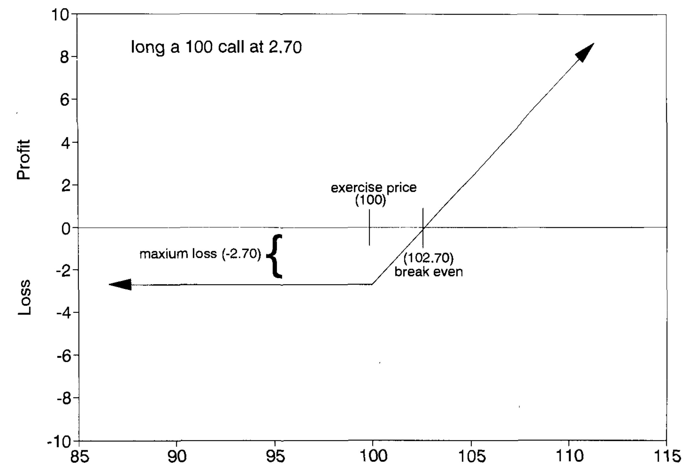
> Holy shit it's relu

## Risk/Reward characteristics
> All the graphs are relu

### Long call
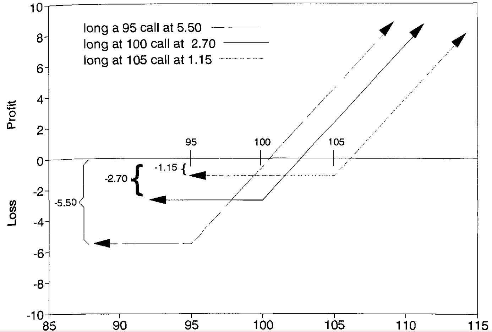
* The higher the price at expiration, the better - you get more cash/share
* Loss is limited to premium, worst case you'll pay the strike price

### Long put
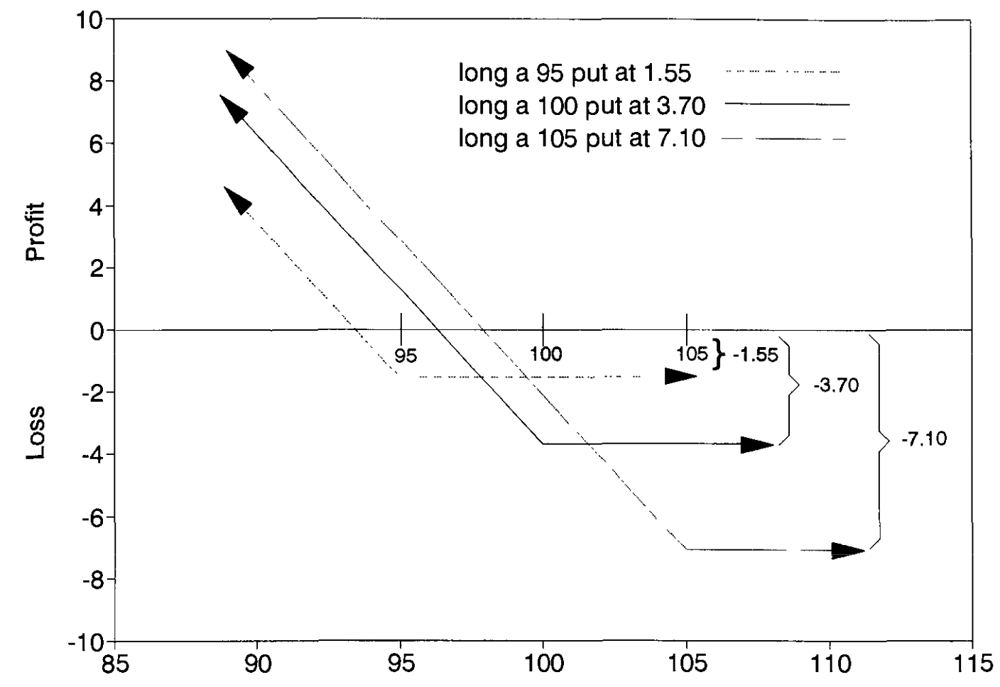
* The lower the price at expiration, the better - you get more shares/cash

### Short call
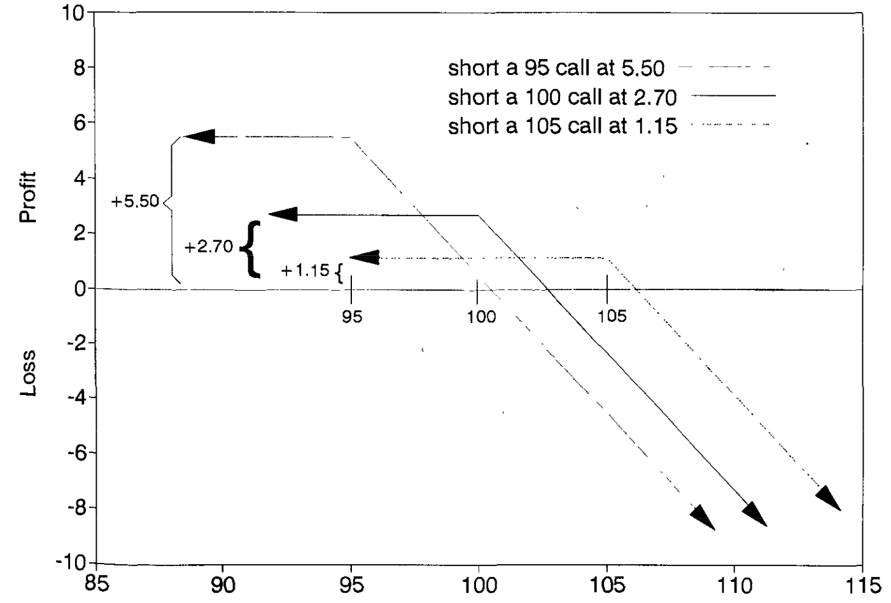
* You're betting it goes down, so you sell the option to buy it
* Loss theoretically infinite since the asset value can go infinitely up (not likely though) (losing potential earnings)
* Gain is limited to the premium  
* Example is if someone sold me the right to buy NVIDIA at $600 in January, and it rises to $1000. They lose $400 - premium dollars

### Short put
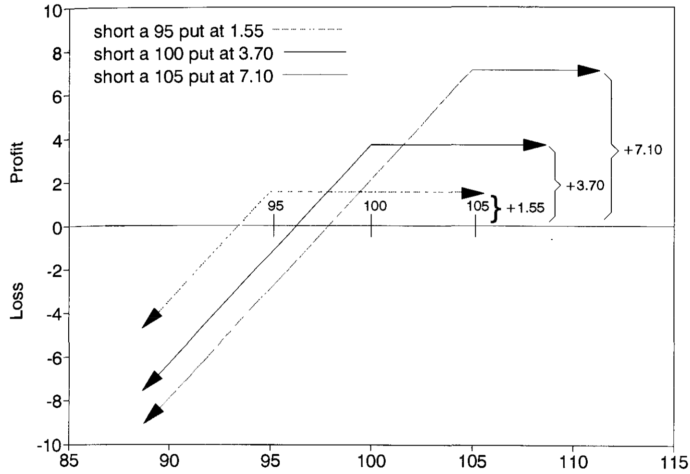
* You're betting it goes up, so you sell the option to sell it
* Loss capped at strike price
* Gain limited to premium
* Example is if someone sold me the right to sell Boeing at $200, and it drops to $184. I sell, they lose $16 - premium dollars because they pay more for something worth less.

Avoiding risk is impossible as a trader. You've gotta hedge your bets, cover your positions, and consider the probabilities of everything happening. Like russian roulette with a PKP for ten billion dollars.

## Combination strategies
> 

* Maximum loss is 6.4, only if the option is 100 at expiration
* Range for which you make money either way
* Sensible if there's gonna be movement definitely, but you don't know which way

Vice versa for shorts - if you're pretty damn sure it'll stay the same. Otherwise loss is basically uncapped.
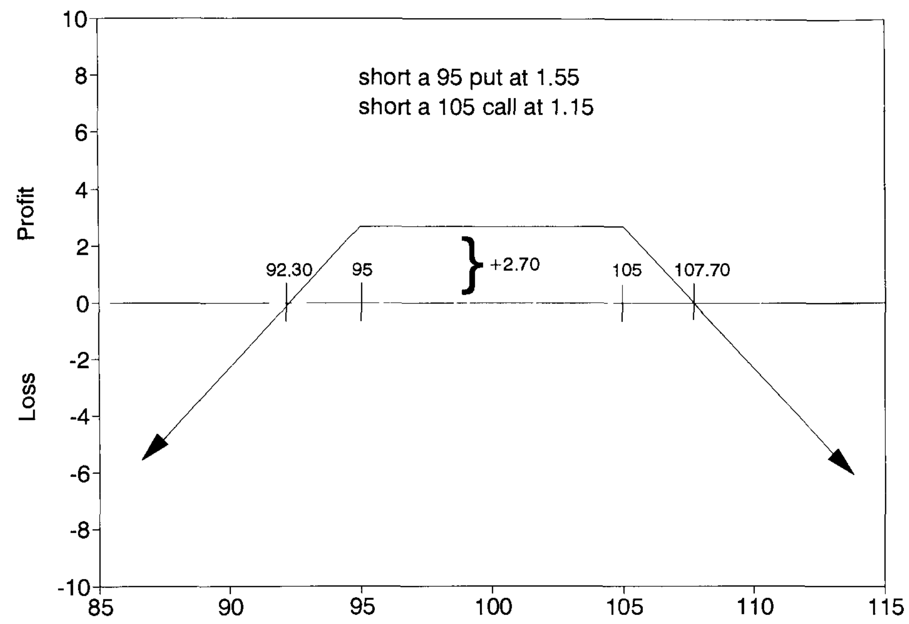

You can also long *and* short to create capped profits and losses.

## Rules for the graphs
1. Bends and corners will happen at the exercise prices
2. If the position is long and short equal number of calls, the potential downside risk/reward will be equal to the total amount of credit/debit used to establish the position 
    * If it's short + long, risk/reward is capped by premiums given/taken
3. Above the highest strike price all calls will go into the money, below the lowest exercise price all puts will go into the money
    * "so the entire position will act like an underlying position which is either long or short underlying contracts equal to the number of net long/short calls" for calls above
    * "so the entire position will act like an underlying position which is either long or short underlying contracts equal to the number of net long/short puts" for puts below

### Consider
* Long 95 call at 5.5
* Short three 105 calls at 1.15
* Max downside is 5.5 - 3(1.15) - 2.05
* Max upside is 5.5 + 3(1.15) = 7.95
* After 105 profits decrease by 2 per each increase 

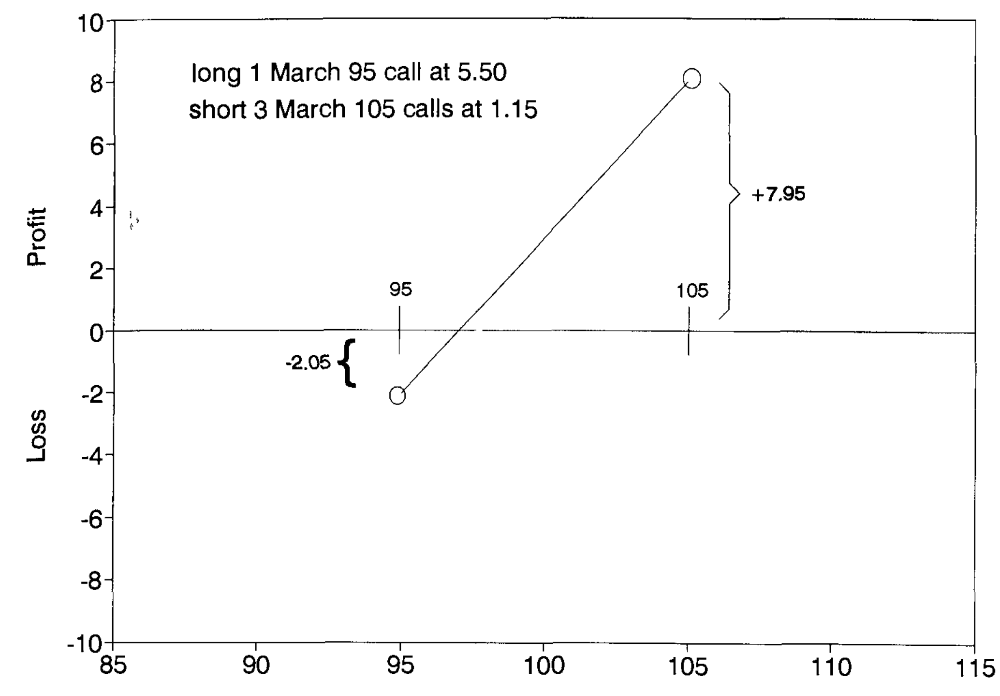
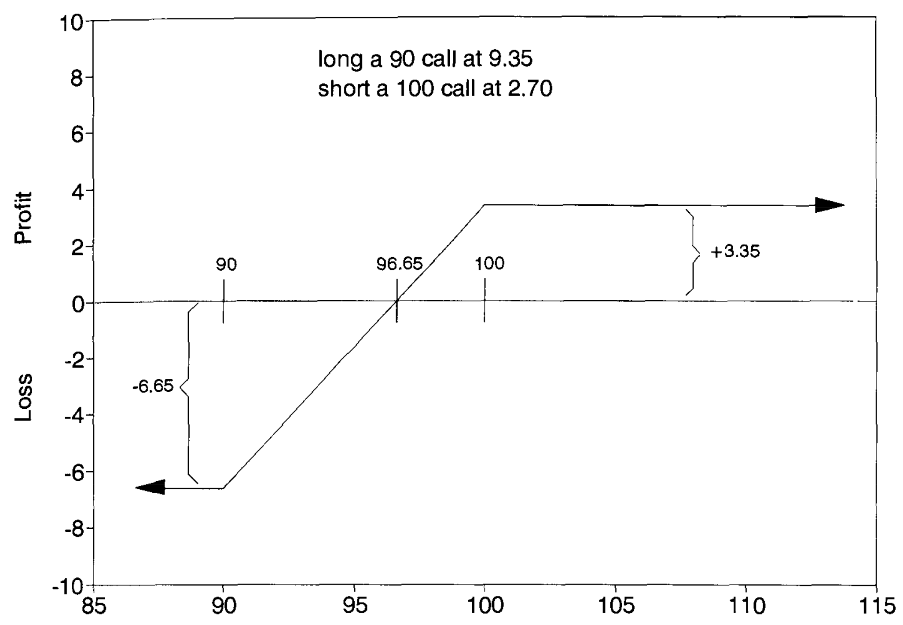

### Consider a more complex example
* Short one 90 call at 9.35
* Long two 100 calls at 2.7
* Short four 95 puts at 2.7
* Long two 100 puts at 3.7

1. What happens at the exercise prices?
    * 90: +2.75
    * 95: +7.75
    * 100: -7.25
> Bends *only occur at exercise prices*
2. Analyze the nature of each option around the extreme exercise prices
    * Below 90 all calls are worthless and all puts are short underlying contracts. Position is net short two puts, position **acts as a long underlying contract**. Each point down = two points loss
    * Above 100 all puts are worthless, all calls are long underlying contracts. Position is new long one call, above 100 it **acts as a long underlying contract**. Each point up = one point profit
3. As long as all options expire at the same time, the value of the position at expiration will be fully determined by the price of the underlying contract

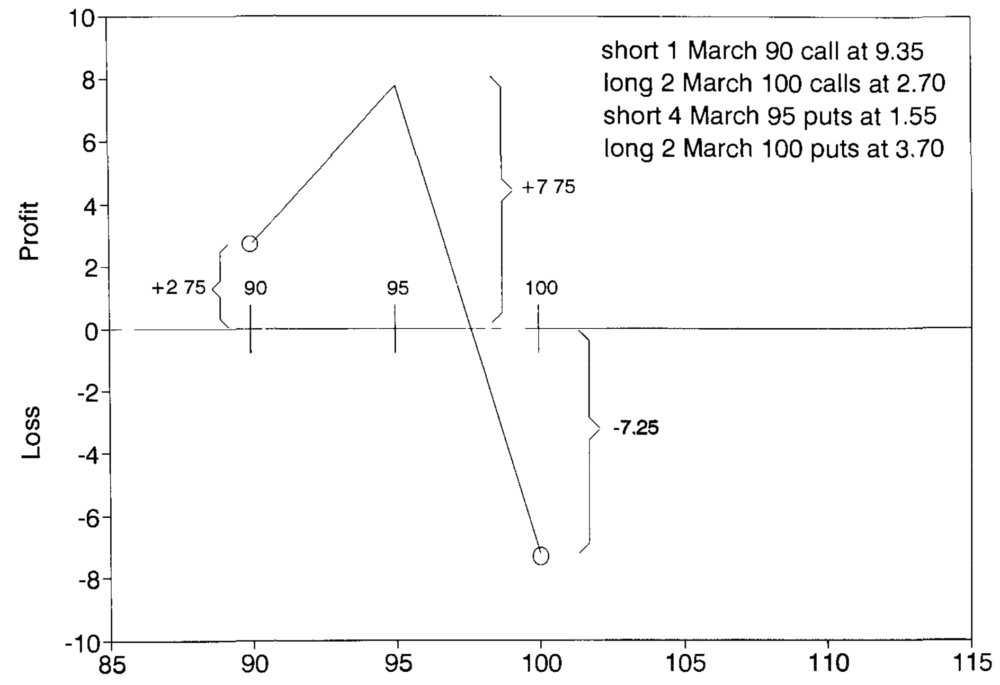
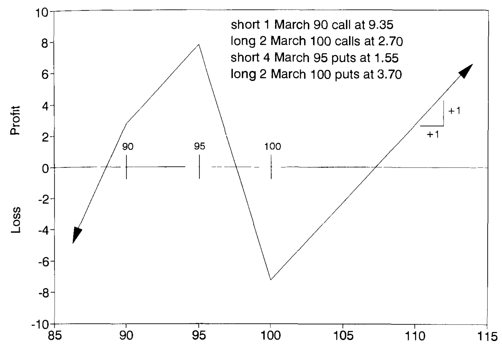

### Consider another example
* Long one 100 call at 2.7
* Short one 100 put at 3.7

Breakeven at 99, calls worthless < 100, puts worthless > 100; uncapped loss and gain, profit of 1 at 100; mimics long underlying position anywhere at expiration (only difference between actual long and option long)

### Another one
* Long one 90 put at 0.45
* Short one 100 call at 2.70
* Long one underlying contract at 99.00 (buying the asset directly)

Cap losses of purchase, anticipate potential gains. Basically a long 90 call.

### Another another one
* Long 90 call at 9.35
* Long 90 put at 0.45, long underlying contract at 99.00

Same graph, higher loss cap since it's 9.35 not 0.45

* In practice, rarely do traders let options go to expiration
* Strategy changes as markets change
* *Every trader reserves the right to make a more intelligent decision today than he made yesterday*
* Not very Buffett/Munger like behavior

(few pages of example data, practice later)

